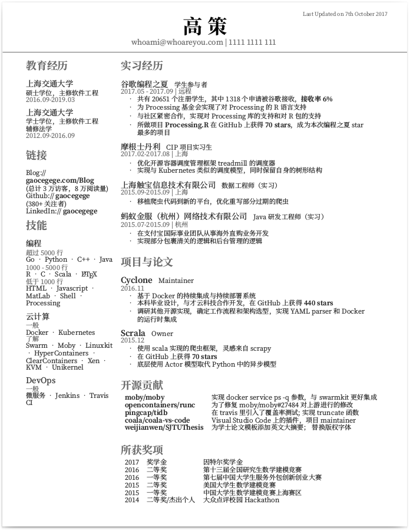

# 张靖昊 · 简历

基于 [Deedy-Resume](https://github.com/deedydas/Deedy-Resume) 的单页双栏 LaTeX 简历模板，支持中英文排版。

## 预览

<div align="center">
    
</div>

## 目录结构

```
├── OpenFonts.Chinese/          # 中文版简历
│   ├── resume.tex              # 主文件
│   ├── deedy-resume-openfont.cls  # 文档类
│   └── fonts/                  # 中文字体文件
├── docs/                       # 编译输出 PDF
├── scripts/                    # 构建脚本
├── Makefile                    # 构建命令
└── README.md
```

## 编译

需要 **XeLaTeX** 编译器。

```bash
# 直接编译
cd OpenFonts.Chinese && xelatex resume.tex

# 或使用 Makefile
make
```

## 简历要点

- **求职方向**：AI 智能体 / 软件架构 / 全栈开发
- **当前职位**：华为 AI 及软硬件开发工程师 & 金牌讲师
- **所在地**：浙江杭州 · 1997 年
- **核心技能**：多 Agent 架构 · MCP · RAG · Spring Boot · Node.js · OpenHarmony · 模型部署
- **项目亮点**：企业知识库问答 Agent 平台、鸿蒙端云协同安防、AI 语音交易助手、微服务培训中台

## 致谢

- 感谢 [Deedy-Resume](https://github.com/deedydas/Deedy-Resume) 提供的原始模板
- 感谢 Adobe 开源的[思源系列字体](https://github.com/adobe-fonts)

## License

Apache 2.0 — 字体部分见各自开源协议
